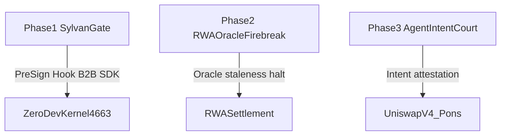

# Strategic Post-Hackathon Roadmap — Robinhood Chain (4663)

**SKU:** `@slivervine/sylvangate`  
**Home Chain:** Robinhood Chain Mainnet `4663` / Testnet `46630`

Related docs: [01-technical-blueprints.md](./01-technical-blueprints.md) · [02-cross-chain-architecture-faq.md](./02-cross-chain-architecture-faq.md)

## Three-Tier Architecture

```text
┌─────────────────────┐       ┌──────────────────────────┐       ┌─────────────────────┐
│   HOME · 4663       │  ──►  │  DECISION (off-chain)    │  ──►  │   DEST · 42161      │
│   Robinhood Chain   │       │  SylvanGate SDK          │       │   Arbitrum One      │
├─────────────────────┤       ├──────────────────────────┤       ├─────────────────────┤
│ Kernel UserOp       │       │ SylvanGateGuard          │       │ GM pool metadata    │
│ SVESC attestation   │       │ checkAirlockThreshold      │       │ (planned yield dest)│
│ (on-chain)          │       │ assertUnidirectionalBridge│     │ (not 4663 RPC call) │
└─────────────────────┘       └──────────────────────────┘       └─────────────────────┘
```

**Flow:** `4663 → 42161` outbound only · `42161 → 4663` fail-closed · `lostUsd ≡ 0`.

---

## Executive Summary

**Selected architecture:** ZeroDev AA **pre-sign coprocessor** on Robinhood Chain (`4663`) — off-chain `checkAirlockThreshold()` and `SylvanGateGuard` / `guardAgentUserOp` evaluate intent before UserOp bundling. On-chain ERC-7579 Type-4 hook is **not shipped** in this SKU (`hookInstalled: false`).

**Product positioning:** B2B Pre-Sign Security SDK — embed a sub-microsecond Wasm risk reflex as an off-chain coprocessor before UserOp bundling, rather than deploying full-chain middleware or on-chain oracle hooks as the primary SKU.

ZeroDev Kernel v4 (Extendable Condition Interface and Permission/Policy Hooks) aligns with SliverVine's `checkAirlockThreshold()` pre-sign design as **readiness types only**. The active validation demo runs Kernel **v0.3.1** + EntryPoint 0.7.

---

## Core Value Proposition

| Capability | Module | Metric / Claim |
|------------|--------|----------------|
| Wasm airlock threshold | `checkAirlockThreshold()` · `computeSoilSlippageMetrics` | p50 ~15µs Wasm lane ([Blueprint 4](./01-technical-blueprints.md#latency-honest)) |
| 0-Gas pre-sign severance | `applySoilTripSeverance()` → `severSigningChannel()` | Trip rejects before UserOp reaches sequencer |
| ERC-7579 / Kernel v4 readiness | `ZeroDevV4ConditionProbe` · `ZERODEV_KERNEL_V4_CONDITION_INTERFACE_READY` | v4 beta-SDK interface spec; demo remains v3 |

**Integration flow:**

```
Agent Intent → ZeroDevV4ConditionProbe.evaluate(checkAirlockThreshold) → pass → guardAgentUserOp → Kernel v0.3.1 bundler
                                      ↓ trip
                                 0-Gas severance (no broadcast)
```

---

## Post-Hackathon Product Lines (Phase 1–3)



### Phase 1 — SliverVine SylvanGate (Primary SKU)

ZeroDev B2B Security SDK and Pre-Sign Hook for AI trading agents on Robinhood Chain.

| Deliverable | Status | Core modules |
|-------------|--------|--------------|
| SylvanGate intent gate | **Shipped (validation scenario)** | `zerodev-aa/` · `across-ingress-bridge.ts` |
| Agent UserOp soil shield | Decision-only complement | `agent-exomesh-guard.ts` |
| Scenario demo | `pnpm demo:robinhood-sentinel` → ALL PATHS PASS | `examples/robinhood-sentinel-demo.ts` |
| Kernel v4 condition readiness | Type spec exported | `ZeroDevV4ConditionProbe` in `zerodev-aa-types.ts` |

### Phase 2 — RWA Oracle Firebreak

Market calendar enforcement, Chainlink oracle staleness detection, and stock-token halt circuit-breaker for RWA settlement paths.

| Scope | Notes |
|-------|-------|
| Oracle staleness fuse | Decision-layer guard; not a live Chainlink adapter in this SKU slice |
| Market calendar halt | Complements treasury escort quote (`treasury-escort-router.ts`) |
| Scenario demo | **Not included** — Blueprint 3 complement only |

### Phase 3 — Agent Intent Court / Hook Passport

Intent sanitization and attestation registry for Uniswap v4 hooks and Pons launchpad agents.

| Scope | Notes |
|-------|-------|
| Intent digest binding | `AirlockThresholdInput.intentDigest` + `intentAction` fields |
| Launchpad guard | Blueprint 1 / Blueprint 4 complement (Pons simulation narrative) |
| Wallet middleware | **Not shipped** — SDK decision probes with 0 broadcast |

---

## Architecture decisions (explicit non-goals)

- Full-chain middleware as primary SKU (too heavy for the Robinhood escort slice)
- On-chain oracle hook as v1.0 requirement (`hookInstalled: false` preserved)
- Inbound `42161 → 4663` bridge without airlock predicate (`assertUnidirectionalBridge` fail-closed)

---

## Technical Cross-References

| Topic | Document / Module |
|-------|-------------------|
| Blueprint 2 v4 alignment | [01-technical-blueprints.md — Blueprint 2](./01-technical-blueprints.md#blueprint-2--ai-agent--zerodev-perps) |
| Cross-chain honesty | [02-cross-chain-architecture-faq.md](./02-cross-chain-architecture-faq.md) |
| v4 type SSOT | `src/adapters/arbitrum/zerodev-aa/zerodev-aa-types.ts` |
| Wasm soil engine | `src/core/risk-engine-airlock.ts` · `src/core/airlock-wasm-runtime.ts` |

---

## Honesty Footnotes

- **Active demo:** Kernel **v0.3.1** + EntryPoint 0.7; v4 Extendable Condition = readiness spec only (`ZERODEV_KERNEL_V4_CONDITION_INTERFACE_READY`).
- **Phase 2 / Phase 3:** Not in `pnpm demo:robinhood-sentinel` validation scenarios — decision-only complements.
- **SliverVine vault / bridge buffer:** `contractDeployed: false` · `bridgeDeployed: false` — applies to proprietary yield vault only; ZeroDev Kernel on `4663` is third-party live infrastructure.
- **Live-fire replay:** Demo references archived evidence — does **not** re-broadcast mainnet txs.
