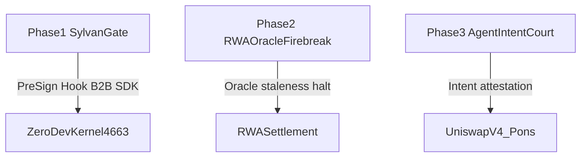

# Strategic Post-Hackathon Roadmap — Robinhood Chain (4663)

**SKU:** `@slivervine/sylvangate`  
**Home Chain:** Robinhood Chain Mainnet `4663` / Testnet `46630`

Related docs: [TECHNICAL_BLUEPRINTS.md](./TECHNICAL_BLUEPRINTS.md) · [CROSS_CHAIN_ARCHITECTURE_FAQ.md](./CROSS_CHAIN_ARCHITECTURE_FAQ.md)

---

## Executive Summary

Following an exhaustive multi-AI architectural evaluation across **six premier AI platforms** — DeepSeek, Perplexity, Grok, Claude 3.5 Sonnet, Kimi, and Qwen — the consensus verdict selects **Option 3: ZeroDev AA Coprocessor / Pre-Sign Hook** as SliverVine Protocol's long-term primary engine on Robinhood Chain.

**Winning positioning:** ZeroDev B2B Security SDK — embed a sub-microsecond Wasm risk reflex as an off-chain coprocessor before UserOp bundling, rather than deploying full-chain middleware or on-chain oracle hooks as the primary SKU.

ZeroDev's recent Kernel v4 architecture (Extendable Condition Interface and Permission/Policy Hooks) natively validates SliverVine's dynamic `checkSoilResistance()` pre-sign Wasm design. The active judge demo continues on Kernel **v0.3.1** + EntryPoint 0.7; v4 alignment is exported as interface-readiness types only.

---

## Core Value Proposition

| Capability | Module | Metric / Claim |
|------------|--------|----------------|
| Wasm soil reflex | `checkSoilResistance()` · `computeSoilSlippageMetrics` | p50 ~15µs Wasm lane ([Blueprint 4](./TECHNICAL_BLUEPRINTS.md#latency-honest)) |
| 0-Gas pre-sign severance | `applySoilTripSeverance()` → `severSigningChannel()` | Trip rejects before UserOp reaches sequencer |
| ERC-7579 / Kernel v4 readiness | `ZeroDevV4ConditionProbe` · `ZERODEV_KERNEL_V4_CONDITION_INTERFACE_READY` | v4 beta-SDK interface spec; demo remains v3 |

**Integration formula (Option 3):**

```
Agent Intent → ZeroDevV4ConditionProbe.evaluate(checkSoilResistance) → pass → guardAgentUserOp → Kernel v0.3.1 bundler
                                      ↓ trip
                                 0-Gas severance (no broadcast)
```

---

## Post-Hackathon Product Lines (Phase 1–3)



### Phase 1 — SliverVine SylvanGate (Primary SKU)

ZeroDev B2B Security SDK and Pre-Sign Hook for AI trading agents on Robinhood Chain.

| Deliverable | Status | Core modules |
|-------------|--------|--------------|
| SylvanGate intent gate | **Shipped (hero path)** | `zerodev-aa/` · `across-ingress-bridge.ts` |
| Agent UserOp soil shield | Decision-only complement | `agent-exomesh-guard.ts` |
| Judge demo | `pnpm demo:robinhood-sentinel` → ALL PATHS PASS | `examples/robinhood-sentinel-demo.ts` |
| Kernel v4 condition readiness | Type spec exported | `ZeroDevV4ConditionProbe` in `zerodev-aa-types.ts` |

### Phase 2 — RWA Oracle Firebreak

Market calendar enforcement, Chainlink oracle staleness detection, and stock-token halt circuit-breaker for RWA settlement paths.

| Scope | Notes |
|-------|-------|
| Oracle staleness fuse | Decision-layer guard; not a live Chainlink adapter in this SKU slice |
| Market calendar halt | Complements treasury escort quote (`treasury-escort-router.ts`) |
| Hero demo | **Not included** — Blueprint 3 complement only |

### Phase 3 — Agent Intent Court / Hook Passport

Intent sanitization and attestation registry for Uniswap v4 hooks and Pons launchpad agents.

| Scope | Notes |
|-------|-------|
| Intent digest binding | `SoilResistanceInput.intentDigest` + `intentAction` fields |
| Launchpad guard | Blueprint 1 / Blueprint 4 complement (Pons simulation narrative) |
| Wallet middleware | **Not shipped** — SDK decision probes with 0 broadcast |

---

## Strategic Alignment Table

Summary of six-platform consensus points mapped to Option 3. Table entries are architectural narrative summaries — not verbatim external AI outputs.

| Platform | Consensus focus | Aligns with Option 3 |
|----------|-----------------|----------------------|
| **DeepSeek** | B2B coprocessor over full-chain middleware | Pre-sign hook; minimal on-chain surface |
| **Perplexity** | ZeroDev AA + policy hooks as integration vector | Permissions Policies = soil trip fuse |
| **Grok** | Agent HFT requires sub-ms off-chain gate | Wasm reflex + 0-Gas severance |
| **Claude 3.5 Sonnet** | Fail-closed intent gate before broadcast | `guardAgentUserOp` decision layer |
| **Kimi** | Robinhood-native escort SKU over monorepo sprawl | Standalone `@slivervine/sylvangate` |
| **Qwen** | Kernel v4 condition modules validate Wasm design | `ZeroDevV4ConditionProbe` readiness |

**Unanimous rejection patterns (all six platforms):**

- Full-chain middleware as primary SKU (too heavy for 4663 reserved slot)
- On-chain oracle hook as v1.0 requirement (`hookInstalled: false` honesty preserved)
- Inbound `42161→4663` bridge without airlock predicate

---

## Technical Cross-References

| Topic | Document / Module |
|-------|-------------------|
| Blueprint 2 v4 alignment | [TECHNICAL_BLUEPRINTS.md — Blueprint 2](./TECHNICAL_BLUEPRINTS.md#blueprint-2--ai-agent--zerodev-perps) |
| Cross-chain honesty | [CROSS_CHAIN_ARCHITECTURE_FAQ.md](./CROSS_CHAIN_ARCHITECTURE_FAQ.md) |
| v4 type SSOT | `src/adapters/arbitrum/zerodev-aa/zerodev-aa-types.ts` |
| Wasm soil engine | `src/core/risk-engine-soil.ts` · `src/core/soil-wasm-runtime.ts` |

---

## Honesty Footnotes

- **Active demo:** Kernel **v0.3.1** + EntryPoint 0.7; v4 Extendable Condition = readiness spec only (`ZERODEV_KERNEL_V4_CONDITION_INTERFACE_READY`).
- **Phase 2 / Phase 3:** Not in `pnpm demo:robinhood-sentinel` hero paths — decision-only complements.
- **SliverVine vault / bridge buffer:** `contractDeployed: false` · `bridgeDeployed: false` — applies to proprietary yield vault only; ZeroDev Kernel on `4663` is third-party live infrastructure.
- **Live-fire replay:** Demo references archived evidence — does **not** re-broadcast mainnet txs.
