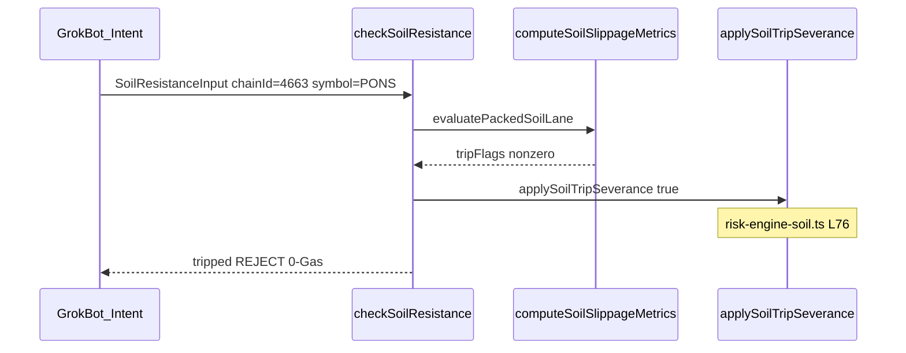

# Technical Blueprints — Robinhood Chain (4663)

**SKU:** `@slivervine/sylvangate`  
**Primary judge demo:** `pnpm demo:robinhood-sentinel` (Hero 1–3)

Complement blueprints below are **decision-only** modules — not shipped hero paths.  
Architecture: [docs/CROSS_CHAIN_ARCHITECTURE_FAQ.md](./CROSS_CHAIN_ARCHITECTURE_FAQ.md) · Roadmap: [docs/STRATEGIC_POST_HACKATHON_ROADMAP.md](./STRATEGIC_POST_HACKATHON_ROADMAP.md)

---

## Blueprint Index

| # | Name | Summary | Core modules |
|---|------|---------|--------------|
| **1** | Retail DEX / Pons Guard | `checkSoilResistance` pre-sign slippage/depth trip @ 4663 | `risk-engine-soil.ts` · `soil-wasm-runtime.ts` |
| **2** | AI Agent / ZeroDev Perps | `evaluateAgentExoMeshGuard` + `guardAgentUserOp` (no Arcus/Lighter adapter) | `agent-exomesh-guard.ts` |
| **3** | Treasury Escort & Audit | `buildRobinhoodAuditSnapshot` + risk-feed formatting | `robinhood-audit-snapshot.ts` · `treasury-escort-router.ts` |
| **4** | Grok Bot × Pons Launchpad | AI agent HFT simulation + Wasm soil severance (this doc) | `risk-engine-soil.ts` · `soil-resistance-types.ts` |

---

## Blueprint 2 — AI Agent / ZeroDev Perps

Agent UserOp intent shield for ZeroDev Kernel accounts — **decision-only** in this SKU slice (not a hero path).

| Export | File | Role |
|--------|------|------|
| `evaluateAgentExoMeshGuard()` | `src/core/agent-exomesh-guard.ts` | Maps agent intent → `SoilResistanceInput` → `checkSoilResistance()` |
| `guardAgentUserOp()` | `src/core/agent-exomesh-guard.ts` | Async gate; returns reject payload on soil trip |
| `ZERODEV_KERNEL_VERSION` | `zerodev-aa-constants.ts` | Current demo: **v0.3.1** + EntryPoint 0.7 |

Flow: agent intent → soil reflex → pass → existing v3 UserOp draft / bundler path; trip → **0-Gas reject** before broadcast.

### ZeroDev Kernel v4 Extendable Condition Interface Alignment

ZeroDev Kernel v4 (beta-SDK) introduces the **Extendable Condition Interface** — pluggable off-chain evaluators that must return a dynamic pass/fail verdict before UserOp bundling.

SliverVine maps this spec to existing Wasm infrastructure:

| v4 concept | SliverVine export | Location |
|------------|-------------------|----------|
| Condition evaluator | `checkSoilResistance()` | `src/core/risk-engine-soil.ts` |
| Probe type wrapper | `ZeroDevV4ConditionProbe` | `zerodev-aa-types.ts` |
| Readiness flag | `ZERODEV_KERNEL_V4_CONDITION_INTERFACE_READY = true` | `zerodev-aa-constants.ts` |

**Upstream terminology** (`@zerodev/sdk@5.5.10`):

| Upstream concept | SliverVine |
|------------------|------------|
| Permission Policy (when) | `checkSoilResistance()` trip fuse |
| `KernelValidatorHook` | off-chain pre-execution gate (`hookInstalled: false` honesty) |
| Extendable Condition (v4 beta) | `ZeroDevV4ConditionProbe` |
| `KERNEL_V3_1` | `ZERODEV_KERNEL_VERSION` |

**Pre-bundle gate:** `ZeroDevV4ConditionProbe.evaluate(input)` runs the sub-microsecond Wasm soil reflex (`computeSoilSlippageMetrics` lane, p50 ~15µs) as an **off-chain / edge pre-condition** — if `tripped === true`, the UserOp never reaches the ZeroDev bundler. On pass, control falls through to the unchanged v3 path (`guardAgentUserOp` → Kernel 0.3.1 + EP 0.7).

**Honesty:** v4 Extendable Condition types are **not yet published** in `@zerodev/sdk@5.5.10`; `ZERODEV_KERNEL_V4_CONDITION_INTERFACE_READY` is an **interface-readiness declaration**, not a runtime switch. `pnpm demo:robinhood-sentinel` and live-fire probes continue on Kernel **v0.3.1**; v4 alignment is exported as a type spec + adapter constant for integrators targeting the beta-SDK.

#### Internal Note — Kernel v4 Type Interface SSOT

Type definitions in [`zerodev-aa-types.ts`](../src/adapters/arbitrum/zerodev-aa/zerodev-aa-types.ts) position the Wasm engine for ZeroDev v4 beta-SDK condition modules:

| Type | Role |
|------|------|
| `ZeroDevV4ConditionEvaluator` | `(SoilResistanceInput) => SoilResistanceResult` — 1:1 signature with `checkSoilResistance()` |
| `ZeroDevV4ConditionProbe.evaluate` | Off-chain condition module bind point before bundler submission |
| `ZeroDevV4ConditionVerdict.satisfied` | Maps `!soil.tripped` to upstream condition pass/fail |

Integrators bind `evaluate: checkSoilResistance` from `risk-engine-soil.ts`. See [STRATEGIC_POST_HACKATHON_ROADMAP.md](./STRATEGIC_POST_HACKATHON_ROADMAP.md) Phase 1 for long-term SKU positioning.

---

## Blueprint 4 — AI Agent Simulation: Grok Bot x Pons Launchpad Protection

### Scenario

An autonomous LLM trading agent (**Grok Bot / Jev Bot — simulation narrative**) emits a fast buy on **Pons #122** on Robinhood Chain (`chainId: 4663`):

- **Agent intent:** `orderSizeUsd: 1000`, `maxSlippageBps: 100` (1% tolerance)
- **Threat:** front-run / honeypot modeled as **~15% cross-venue slippage** (1500 bps observed) on a shallow launchpad pool
- **Guard:** sub-microsecond Wasm soil reflex via `checkSoilResistance()` — **0-Gas** severance before any UserOp or signature reaches the sequencer

### Execution Flow



### TypeScript Simulation (real `src/core/` exports)

`SoilResistanceInput.maxSlippage` is a **ratio** (not bps). Agent `maxSlippageBps: 100` maps to `maxSlippage: 0.01`. The same mapping exists in `evaluateAgentExoMeshGuard()` via `bpsToRatio(maxSlippageBps)` in `agent-exomesh-guard.ts`.

```typescript
import { ROBINHOOD_MAINNET_CHAIN_ID } from "../sdk/constants";
import { checkSoilResistance } from "../core/risk-engine-soil";
import type { SoilResistanceInput } from "../core/soil-resistance-types";

// 1. Grok Bot autonomous trading intent (simulation)
const grokPonsBuyIntent = {
  agentId: "grok-bot-sim",
  targetMarket: "PONS",
  chainId: ROBINHOOD_MAINNET_CHAIN_ID, // 4663
  orderSizeUsd: 1000,
  maxSlippageBps: 100, // agent tolerance — 1%
};

// 2. Threat: 15% slippage surge + shallow depth (honeypot proxy)
const ponsTrapSoil: SoilResistanceInput = {
  symbol: "PONS",
  chainId: grokPonsBuyIntent.chainId,
  agentId: grokPonsBuyIntent.agentId,
  orderSizeUsd: grokPonsBuyIntent.orderSizeUsd,
  maxSlippage: grokPonsBuyIntent.maxSlippageBps / 10_000, // 0.01
  hlSpot: 1.0,
  hlPerp: 1.0,
  dydxPerp: 1.15, // ~15% cross-venue slippage vs 1% agent fuse
  depthUsd: 50_000, // shallow launchpad pool
  at: new Date(),
};

// 3. Guard: ~15µs Wasm reflex lane → trip → severance
const verdict = checkSoilResistance(ponsTrapSoil);
// verdict.tripped === true
// → applySoilTripSeverance(true) inside checkSoilResistance (risk-engine-soil.ts L76)
// → severSigningChannel() (risk-severance.ts)
// 0-Gas: no UserOp / signature reaches sequencer

// 4. Structured reject payload for Grok Bot probability-model update
// Shape mirrors AgentMemoryRejectPayload from evaluateAgentExoMeshGuard()
const grokRejectPayload = {
  code: "EXOMESH_SLIPPAGE_EXCEEDED",
  rejected: true,
  agentId: grokPonsBuyIntent.agentId,
  targetMarket: "PONS",
  maxSlippageBps: grokPonsBuyIntent.maxSlippageBps,
  observedSlippageBps: Math.round(verdict.crossVenueSlippage * 10_000),
  reasons: verdict.reasons,
  tripped: verdict.tripped,
};
```

### Latency (honest)

| Layer | Claim | Source |
|-------|-------|--------|
| Wasm reflex lane | p50 ~15µs | `tests/scripts/sepsb-reflex-latency.test.ts` |
| Full `checkSoilResistance` | p50 < 1ms | `tests/services/soil-resistance-latency.test.ts` |
| 0-Gas severance | pre-sign reject | `applySoilTripSeverance` → `severSigningChannel()` |

### Real Export Table

| Export | File | Role |
|--------|------|------|
| `checkSoilResistance()` | `src/core/risk-engine-soil.ts` | Soil gate; on trip calls severance |
| `applySoilTripSeverance()` | `src/core/risk-severance.ts` | Invoked inside `checkSoilResistance` on trip |
| `SoilResistanceInput` | `src/core/soil-resistance-types.ts` | Input SSOT |
| `computeSoilSlippageMetrics()` | `src/core/soil-resistance-math.ts` | Wasm lane `tripFlags` |

### Honesty Footnotes

- **Pons #122** — ecosystem narrative only; no token contract address in this repo.
- **Grok / Jev Bot** — simulation narrative; not a shipped integration adapter.
- **Not a hero path** — primary demo remains `pnpm demo:robinhood-sentinel`.
- **Honeypot** — modeled via slippage + depth trip; no literal `sellTax` calldata parser.
- **`applySoilTripSeverance`** — called **inside** `checkSoilResistance` (L76); callers do not invoke it separately.
- **`services/risk-control-lib/soil-resistance`** — missing in this SKU slice; full hot path may require monorepo checkout. Wasm metrics lane (`computeSoilSlippageMetrics`) is pure `src/core/`.
